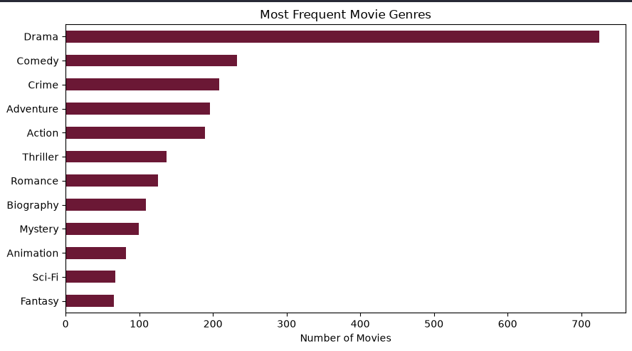
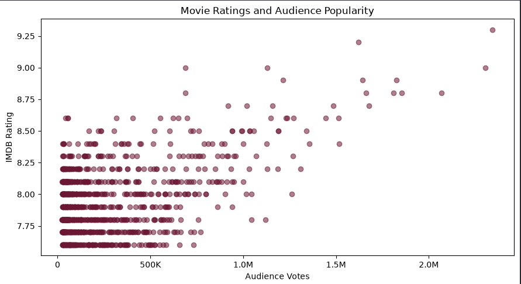
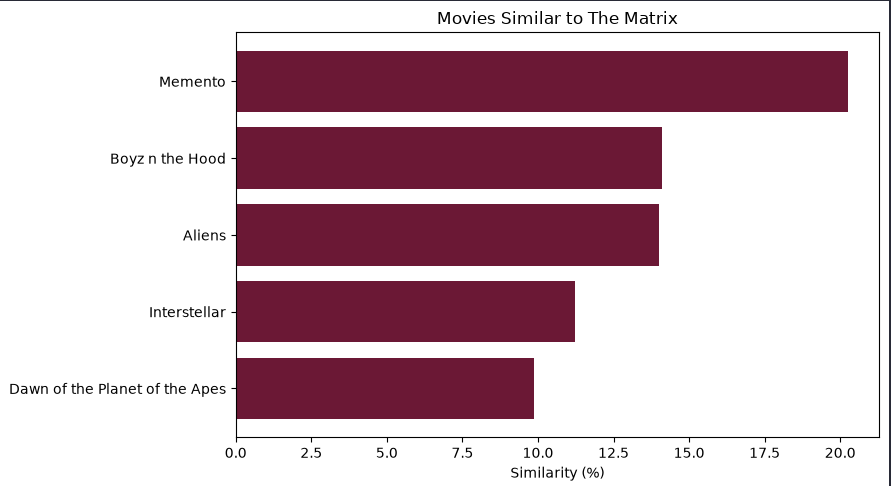
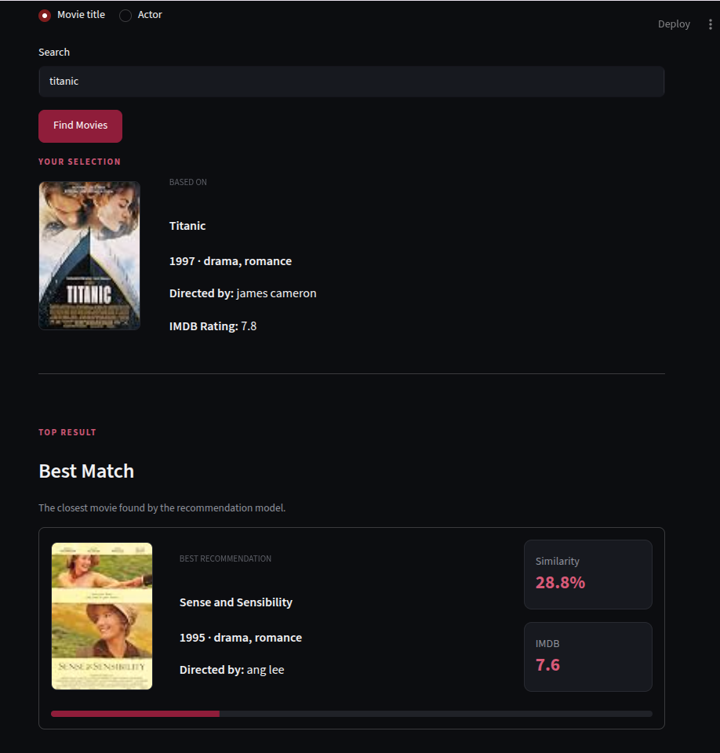
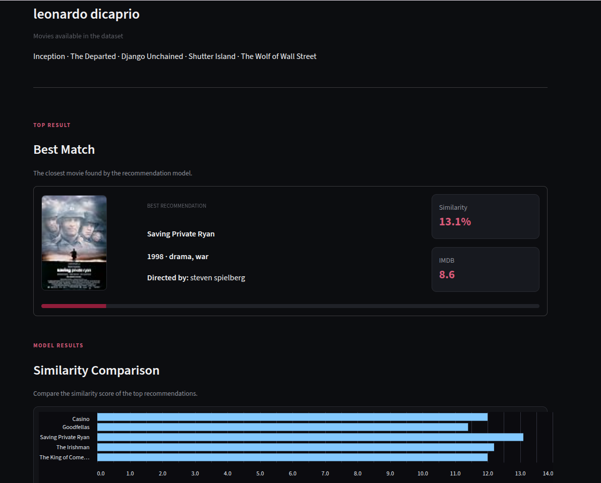

# 🎬 Movie Recommendation System

A content-based movie recommendation system built with **Python, Scikit-learn and Streamlit**.

The project analyzes movie metadata and generates recommendations using **TF-IDF**, **K-Nearest Neighbors (KNN)** and **cosine similarity**.

Users can search by **movie title** or **actor**, and the application includes fuzzy matching to handle partial names and small spelling mistakes.

> **Dataset snapshot:** 2020

---

## Live Demo

Try the interactive application here

https://movie-recommendation-ee8urdhqql7ncnrxl3wmyi.streamlit.app/

---

## Features

- Search recommendations by movie title
- Search recommendations by actor
- Fuzzy search for partial names and spelling mistakes
- Content-based movie recommendations
- Similarity scoring
- Movie posters and IMDb ratings
- Interactive Streamlit interface
- Exploratory data analysis
- Recommendation model evaluation

---

## How It Works

The recommendation pipeline follows this process:

```text
Movie Dataset
      ↓
Data Cleaning
      ↓
Feature Engineering
      ↓
Movie Metadata Combination
      ↓
TF-IDF Vectorization
      ↓
K-Nearest Neighbors
      ↓
Cosine Similarity
      ↓
Top Movie Recommendations
```

Movie characteristics are transformed into numerical vectors using **TF-IDF**.

The recommendation model then uses **KNN with cosine distance** to identify movies with the most similar content profiles.

### Search by Movie

When a movie title is entered:

```text
Movie title
    ↓
Fuzzy title matching
    ↓
Movie feature vector
    ↓
KNN similarity search
    ↓
Top recommendations
```

### Search by Actor

When an actor is entered, the system identifies their movies in the dataset and creates a combined profile from their filmography.

```text
Actor
   ↓
Fuzzy actor matching
   ↓
Movies featuring the actor
   ↓
Average movie feature profile
   ↓
KNN similarity search
   ↓
Top recommendations
```

---

## Exploratory Data Analysis

Before building the recommendation engine, the movie dataset was explored to understand its genres, ratings and audience behavior.

### Most Frequent Movie Genres



This analysis shows the genres most frequently represented in the dataset and provides context for the type of content available to the recommendation model.

### Movie Rating and Audience Popularity



The relationship between **IMDb rating** and **number of audience votes** was analyzed to distinguish highly rated movies from highly popular movies.

---

## Recommendation Model

The recommendation engine uses:

- **TF-IDF** for feature representation
- **K-Nearest Neighbors (KNN)** for nearest-neighbor retrieval
- **Cosine distance/similarity** for comparing movie profiles

### Example: Movies Similar to The Matrix



This visualization shows an example of the similarity scores generated by the recommendation model when using **The Matrix** as the reference movie.

---

## Application

The model is exposed through an interactive **Streamlit** application.

### Search by Movie

Users can enter a movie they already like and receive similar recommendations.



### Search by Actor

The application can also generate recommendations from an actor's filmography.



---

## Project Structure

```text
movie-recommendation/
│
├── .streamlit/
│   └── config.toml
│
├── data/
│   ├── raw/
│   │   └── imdb_top_1000.csv
│   │
│   └── processed/
│       └── movies_clean.csv
│
├── frontend/
│   ├── app.py
│   ├── recommender.py
│   ├── ui.py
│   └── style.css
│
├── images/
│   ├── actor_search_result.png
│   ├── most_frequent_genres.png
│   ├── movie_search_result.png
│   ├── movies_similar_to_matrix.png
│   └── rating_vs_popularity.png
│
├── models/
│   ├── knn_model.pkl
│   ├── movie_matrix.pkl
│   ├── movies.pkl
│   └── vectorizer.pkl
│
├── notebooks/
│   ├── 01_data_understanding.ipynb
│   ├── 02_data_cleaning_eda.ipynb
│   ├── 03_feature_engineering_knn.ipynb
│   └── 04_recommendation_evaluation.ipynb
│
├── .gitignore
├── README.md
└── requirements.txt
```

---

## Notebooks

The analysis and model development are organized into four notebooks.

### 01 — Data Understanding

Initial inspection of the movie dataset, including:

- Dataset structure
- Available features
- Missing values
- Movie metadata
- Initial data quality analysis

### 02 — Data Cleaning & EDA

Data preparation and exploratory analysis:

- Data cleaning
- Genre analysis
- IMDb rating analysis
- Audience popularity analysis
- Preparation for feature engineering

### 03 — Feature Engineering & KNN

Development of the recommendation model:

- Movie metadata preparation
- Feature combination
- TF-IDF vectorization
- Movie feature matrix
- KNN model
- Cosine-based similarity search

### 04 — Recommendation Evaluation

Evaluation of the final recommendation behavior:

- Recommendations by movie
- Recommendations by actor
- Similarity comparison
- Manual recommendation inspection
- Model artifacts export

---

## Technology Stack

### Data & Machine Learning

`Python` `Pandas` `NumPy` `Scikit-learn` `SciPy`

### Modeling

`TF-IDF` `KNN` `Cosine Similarity`

### Visualization

`Matplotlib`

### Application

`Streamlit`

### Development

`Jupyter Notebook` `Git`

---

## Run Locally

### 1. Clone the repository

```bash
git clone https://github.com/Eroscardenas/movie-recommendation.git
cd movie-recommendation
```

### 2. Create a virtual environment

Linux / macOS:

```bash
python3 -m venv .venv
source .venv/bin/activate
```

Windows:

```bash
python -m venv .venv
.venv\Scripts\activate
```

### 3. Install dependencies

```bash
pip install -r requirements.txt
```

### 4. Run the application

```bash
streamlit run frontend/app.py
```

Streamlit will display the local address where the application is running.

---

## Model Artifacts

The trained recommendation artifacts are stored in `models/`:

```text
knn_model.pkl
movie_matrix.pkl
movies.pkl
vectorizer.pkl
```

These files allow the Streamlit application to load the prepared recommendation system without rebuilding the model every time the application starts.

---

## Limitations

The recommendation system is based on a movie dataset snapshot from **2020**.

As a result:

- Movies released after the dataset snapshot are not available.
- Recommendations are limited to movies represented in the dataset.
- Actor searches are limited to actors included in the available movie records.
- Recommendations are content-based and do not use individual user viewing history or ratings.
- Poster availability and quality depend on the image URLs provided by the dataset.

---

## Future Improvements

Potential improvements include:

- Integration with a current movie API
- Updated movie and actor metadata
- Higher-quality poster sources
- User-based recommendations
- Collaborative filtering
- Hybrid recommendation models
- User favorites and recommendation history
- Larger movie catalog

---

## Author

**Racoon Nuit**

Software Engineering · Data Analysis · Machine Learning